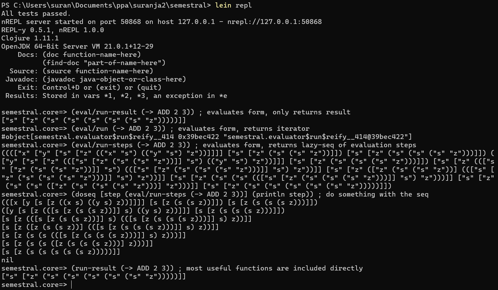
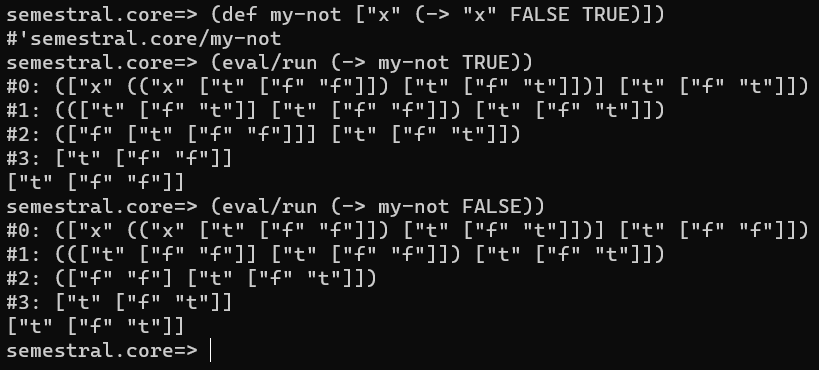
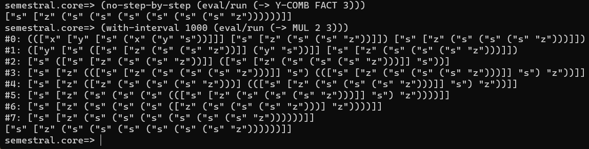
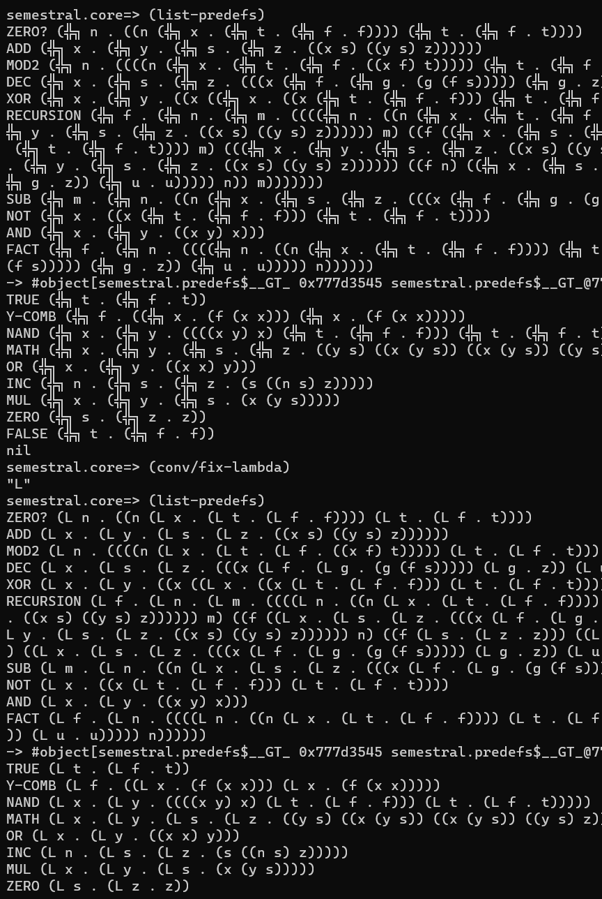

# semestral

You will need Java, Clojure and Leiningen installed. (`java`, `clj`/`clojure`, `lein`)

To run the REPL, there are several options. One of them is to use Leiningen (make sure you run the command
while in this directory with `project.clj`, which is the Leiningen project configuration):

The syntax is simple: You define lambdas as vectors `[arg body]` and applications with `(-> f arg)`, while
you can also call `(-> f x y z)` which expands to `(((f x) y) z)`:

To define lambda with more args, you can also write `(lambda "x y z" body)` or just `(l "x y z" body)` as
a shortcut, the argumentss will by split by space. So you can use multi-letter variable names, but why would you, right?

You can also change the interval of printing intermediate results or turn off the step by step
evaluation entirely, which also disables the evaluation interval.

To list all available symbols, you can run the following. If running from your terminal, it probably won't render
the lambdas natively, so you can change the display mode to `"L"`:

